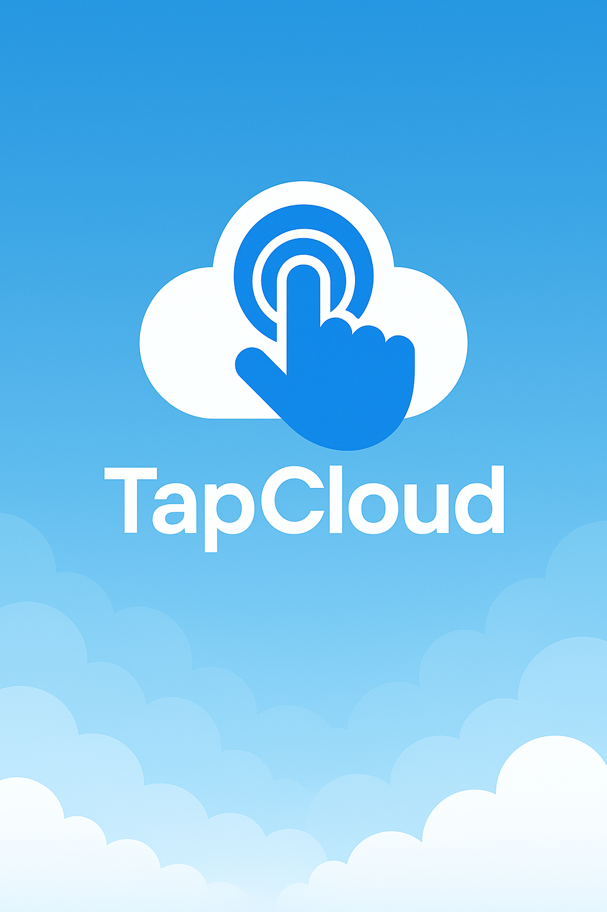

# TapCloud

# TapCloud
...

**TapCloud** is a tap-to-earn Web3 project built on the TON blockchain. Inspired by the success of platforms like Notcoin and TapSwap, TapCloud lets users earn $TCL tokens simply by tapping and engaging with the community.

## What is TapCloud?

TapCloud is a gamified crypto farming experience designed to help onboard new users into the TON ecosystem. It provides a fun and interactive way to farm tokens and invite others, creating a viral loop of growth and engagement.

## Key Features

- **Tap to Farm**: Earn $TCL by tapping the cloud in the WebApp.
- **Referral System**: Invite friends to earn more and climb the leaderboard.
- **Leaderboard**: Compete with others and become a top farmer.
- **Tasks**: Complete missions to earn bonus rewards.
- **TON-based**: Low fees, fast transactions, and fully integrated with Bitget Wallet.

## Token Information

- **Token Name**: TapCloud Token
- **Symbol**: TCL
- **Network**: TON
- **Utility**: Used for boosts, tasks, and future TapCloud ecosystem utilities.

## Roadmap

1. **Community Building** - Launch bot, WebApp, and official channel  
2. **Token Launch (TCL)** - Scheduled before June 2025  
3. **Boosts & Upgrades** - Users can boost their earning rate with TCL  
4. **Exchange Listing** - Aim to list TCL on Bitget Wallet and more  
5. **Staking & Airdrops** - Engage users long-term with rewards  

## Join Us

- Telegram Bot: [@Siharaarabot](https://t.me/Siharaarabot)  
- Channel: [TapCloud Official](https://t.me/tapcloudofficial)  
- Website: [https://tap-cloud-official.vercel.app](https://tap-cloud-official.vercel.app)

---

**TapCloud** is not just a game, it’s your gateway into Web3.
